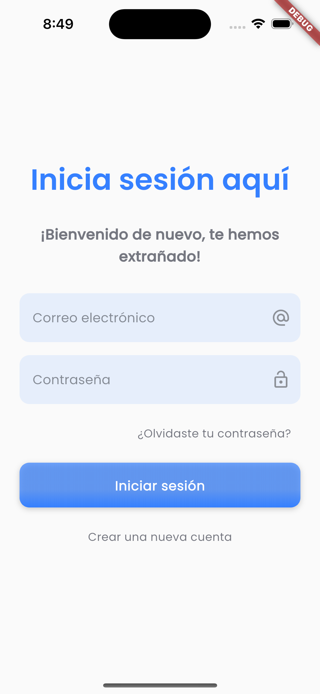
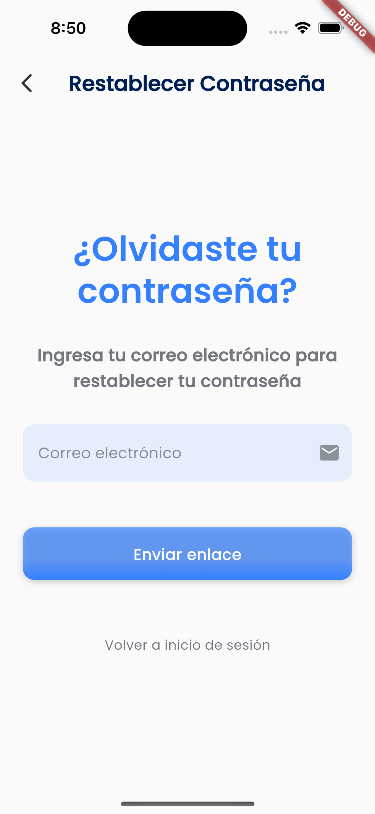
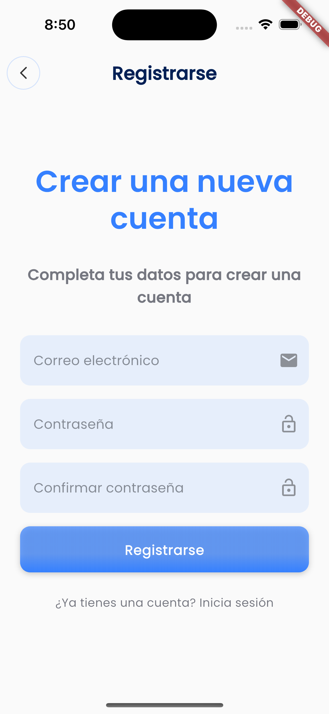
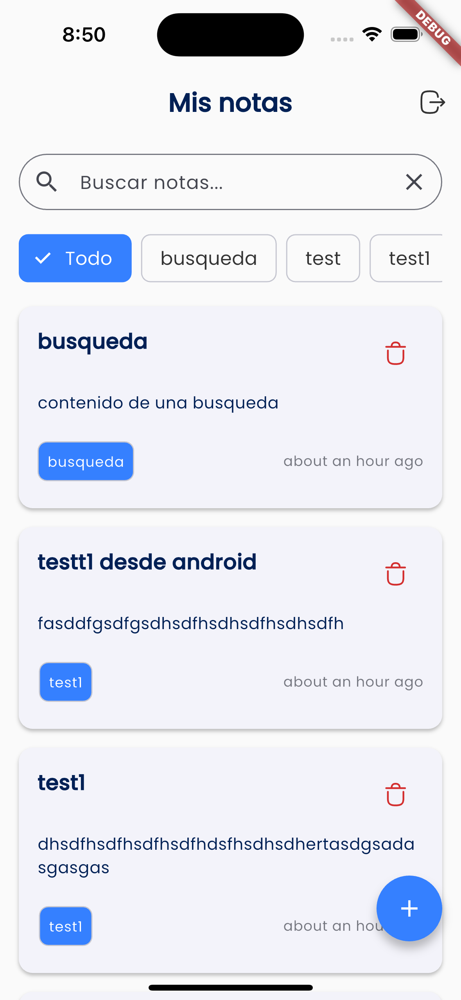
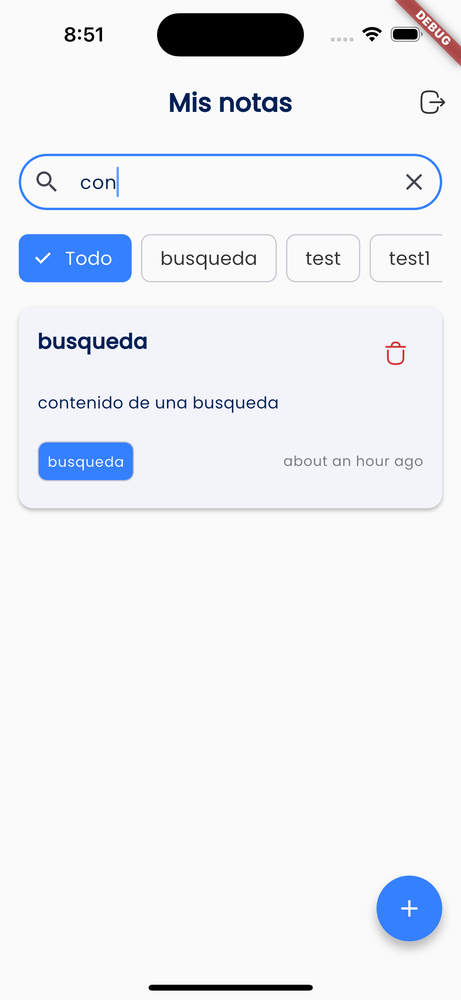

# ImaginaNotes 📝

<p align="center">
   
</p>

<p align="center">
   <a href="#-english"></a>
   <a href="#-español"></a>
</p>

## 🇪🇸 Español

### 📱 Descripción del Proyecto

**ImaginaNotes** es una aplicación móvil desarrollada en Flutter que permite a los usuarios crear y gestionar notas categorizadas de manera eficiente. La aplicación utiliza Firebase para autenticación y almacenamiento de datos, y está estructurada siguiendo el patrón BLoC.

### ✨ Características Principales

✅ **Autenticación completa** - Registro, inicio de sesión y recuperación de contraseña mediante Firebase Authentication  
✅ **Gestión de notas** - Crear, editar, eliminar y visualizar notas  
✅ **Categorización** - Organización de notas por categorías personalizadas  
✅ **Sincronización en tiempo real** - Datos sincronizados con Firebase Firestore  
✅ **Búsqueda de notas** - Funcionalidad de búsqueda integrada  
✅ **Tema oscuro/claro** - Soporte para cambio de tema  
✅ **Multilenguaje** - Disponible en español e inglés  
✅ **Pruebas unitarias** - Garantiza la calidad del código

### 🚀 Configuración del Proyecto

#### Requisitos previos

- Flutter SDK instalado y configurado (versión 3.29.2 del canal estable)
- Cuenta de Firebase
- Git

#### Pasos para configurar

1. **Clonar el repositorio**

   ```bash
   git clone https://github.com/tu-usuario/imaginotas.git
   cd imaginotas
   ```

2. **Instalar dependencias**

   ```bash
   flutter pub get
   ```

3. **Configurar Firebase**

   - Crear un proyecto en [Firebase Console](https://console.firebase.google.com/)
   - Agregar aplicaciones Android e iOS al proyecto manualmente o usando el CLI de firebase
   - Descargar el archivo `google-services.json` y colocarlo en app
   - Descargar el archivo `GoogleService-Info.plist` y colocarlo en Runner
   - Habilitar Authentication con email/password en la consola de Firebase
   - Crear una colección `notes` en Firestore

4. **Configurar variables de entorno**

   - Renombrar el archivo .env.template a .env en la raíz del proyecto
   - Editar el archivo .env con los valores proporcionados por Firebase:

   ```
   FIREBASE_ANDROID_API_KEY=tu_api_key
   FIREBASE_ANDROID_APP_ID=tu_app_id
   FIREBASE_ANDROID_MESSAGING_SENDER_ID=tu_sender_id
   FIREBASE_ANDROID_PROJECT_ID=tu_project_id
   FIREBASE_ANDROID_STORAGE_BUCKET=tu_storage_bucket

   FIREBASE_IOS_API_KEY=tu_api_key_ios
   FIREBASE_IOS_APP_ID=tu_app_id_ios
   FIREBASE_IOS_MESSAGING_SENDER_ID=tu_sender_id_ios
   FIREBASE_IOS_PROJECT_ID=tu_project_id_ios
   FIREBASE_IOS_STORAGE_BUCKET=tu_storage_bucket_ios
   FIREBASE_IOS_BUNDLE_ID=tu_bundle_id_ios
   ```

5. **Ejecutar la aplicación**
   ```bash
   flutter run
   ```

### 🛠️ Tecnologías Utilizadas

- **Flutter** - Framework de UI multiplataforma
- **Firebase Auth** - Autenticación de usuarios
- **Cloud Firestore** - Base de datos NoSQL para almacenamiento
- **flutter_bloc** - Gestión de estado mediante patrón BLoC
- **go_router** - Sistema de navegación y gestión de rutas
- **get_it** - Inyección de dependencias como service locator
- **flutter_svg** - Manejo de imágenes vectoriales
- **flutter_localizations** - Internacionalización
- **google_fonts** - Tipografías personalizadas

### 📸 Capturas de Pantalla

<p align="center">
   
   
   
</p>
<p align="center">
   
   
   
</p>

### 📹 Video Demo

Ver video demo

### 🧪 Pruebas

Para ejecutar las pruebas unitarias:

```bash
flutter test
```

## 🇬🇧 English

### 📱 Project Description

**ImaginaNotes** is a mobile application developed in Flutter that allows users to efficiently create and manage categorized notes. The application uses Firebase for authentication and data storage, and is structured following the BLoC pattern.

### ✨ Main Features

✅ **Complete Authentication** - Registration, login, and password recovery through Firebase Authentication  
✅ **Note Management** - Create, edit, delete, and view notes  
✅ **Categorization** - Organization of notes by custom categories  
✅ **Real-time Synchronization** - Data synchronized with Firebase Firestore  
✅ **Note Search** - Integrated search functionality  
✅ **Dark/Light Theme** - Support for theme switching  
✅ **Multilingual** - Available in Spanish and English  
✅ **Unit Tests** - Ensures code quality

### 🚀 Project Setup

#### Prerequisites

- Flutter SDK installed and configured (version 3.29.2 from stable channel)
- Firebase Account
- Git

#### Setup Steps

1. **Clone the repository**

   ```bash
   git clone https://github.com/tu-usuario/imaginotas.git
   cd imaginotas
   ```

2. **Install dependencies**

   ```bash
   flutter pub get
   ```

3. **Configure Firebase**

   - Create a project in [Firebase Console](https://console.firebase.google.com/)
   - Add Android and iOS apps to the project manually or using the Firebase CLI
   - Download the `google-services.json` file and place it in the app folder
   - Download the `GoogleService-Info.plist` file and place it in the Runner folder
   - Enable Authentication with email/password in the Firebase console
   - Create a `notes` collection in Firestore

4. **Configure environment variables**

   - Rename the .env.template file to .env in the project root
   - Edit the .env file with the values provided by Firebase:

   ```
   FIREBASE_ANDROID_API_KEY=your_api_key
   FIREBASE_ANDROID_APP_ID=your_app_id
   FIREBASE_ANDROID_MESSAGING_SENDER_ID=your_sender_id
   FIREBASE_ANDROID_PROJECT_ID=your_project_id
   FIREBASE_ANDROID_STORAGE_BUCKET=your_storage_bucket

   FIREBASE_IOS_API_KEY=your_ios_api_key
   FIREBASE_IOS_APP_ID=your_ios_app_id
   FIREBASE_IOS_MESSAGING_SENDER_ID=your_ios_sender_id
   FIREBASE_IOS_PROJECT_ID=your_ios_project_id
   FIREBASE_IOS_STORAGE_BUCKET=your_ios_storage_bucket
   FIREBASE_IOS_BUNDLE_ID=your_ios_bundle_id
   ```

5. **Run the application**
   ```bash
   flutter run
   ```

### 🛠️ Technologies Used

- **Flutter** - Cross-platform UI framework
- **Firebase Auth** - User authentication
- **Cloud Firestore** - NoSQL database for storage
- **flutter_bloc** - State management using BLoC pattern
- **go_router** - Navigation and route management system
- **get_it** - Dependency injection as service locator
- **flutter_svg** - Vector image handling
- **flutter_localizations** - Internationalization
- **google_fonts** - Custom typography

### 📸 Screenshots

<p align="center">
   
   
   
</p>
<p align="center">
   
   
   
</p>

### 📹 Demo Video

View demo video

### 🧪 Tests

To run unit tests:

```bash
flutter test
```
